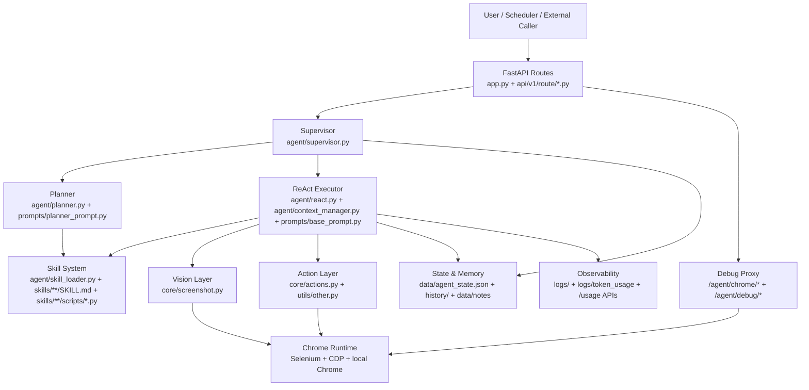
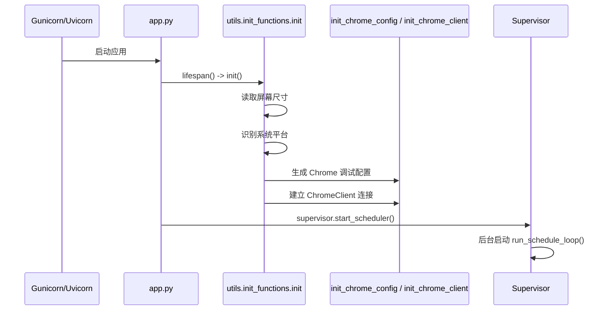
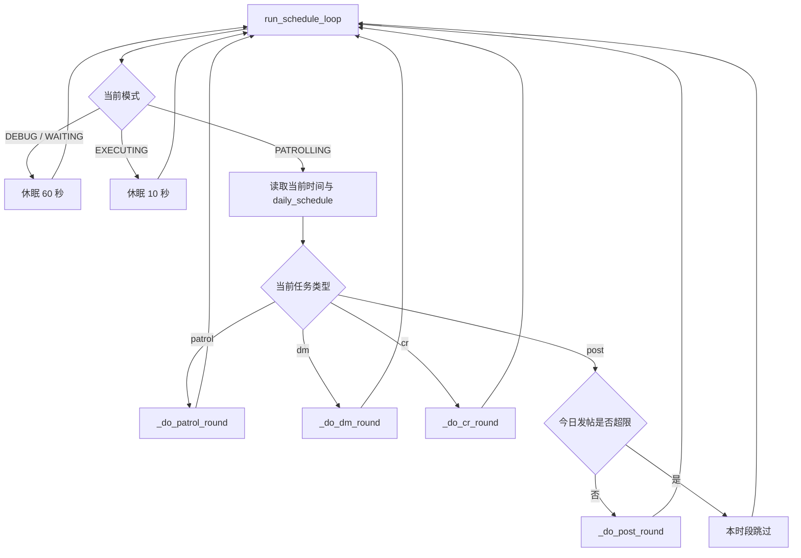

# Project Architecture

本文档面向第一次接手该项目的开发者，目标是快速回答 5 个问题：

1. 这个项目到底是什么。
2. 核心模块分几层，各自负责什么。
3. 一次任务从进入系统到执行完成，数据如何流动。
4. 自动巡逻和手动任务有什么区别。
5. 当前架构的关键风险和可改进点是什么。

## 1. 一句话概括

这是一个运行在 macOS/Windows 上的社交媒体视觉 Agent 服务：

- 外层是 `FastAPI` 服务和一组控制接口。
- 中间是 `Supervisor -> Planner -> ReAct Loop` 的任务编排链路。
- 内层是 `Screenshot + LLM + Actions + Skill Scripts` 的视觉决策与执行闭环。
- 旁路还包括 `Chrome DevTools` 调试代理、日志、历史记录和账号状态持久化。

## 2. 分层架构总览



## 3. 模块地图

| 层级 | 目录/文件 | 作用 | 关键输入 | 关键输出 |
|---|---|---|---|---|
| 入口层 | `app.py` | 启动 FastAPI，注册路由，启动生命周期初始化 | 环境变量、路由模块 | Web 服务 |
| API 层 | `api/v1/route/agent.py` | 任务入口、模式切换、Chrome 调试代理 | HTTP/WS 请求 | 调 `Supervisor` 或代理 Chrome |
| API 层 | `api/v1/route/usage.py` | Token 用量查询 | 本地 `logs/token_usage` | 统计 JSON |
| API 层 | `api/v1/route/callback.py` | 回调结果写回等待队列 | 外部回调数据 | 更新内存队列 |
| 编排层 | `agent/supervisor.py` | 模式管理、自动调度、任务抢占、知识收割 | 配置、状态文件、任务目标 | 调 `run_task()`，更新长期状态 |
| 规划层 | `agent/planner.py` | 用 LLM 把用户目标拆成子任务 | `user_goal`、技能清单 | `tasks[]` |
| 执行层 | `agent/react.py` | ReAct 循环，驱动截图、决策、动作执行 | 子目标、技能 Prompt、截图、上一步结果 | 执行结果、summary |
| 技能层 | `agent/skill_loader.py` | 加载 `SKILL.md` 与动态工具 | `skills/**/SKILL.md`、`scripts/*.py` | 技能元数据、custom tools |
| 视觉层 | `core/screenshot.py` | 截图并转成 base64，可标记鼠标位置 | 当前屏幕 | 多模态图片输入 |
| 动作层 | `core/actions.py` | 把 LLM JSON 动作变成真实鼠标/键盘操作 | `method + params` | 执行结果 |
| 状态层 | `skills/rednote/maintainer/scripts/rednote_sync_account_data.py` | 持久化账号状态、灵感池、标题样本等 | 收割结果、统计信息 | `data/agent_state.json` |
| 初始化层 | `utils/init_functions/*` | 初始化屏幕、平台、Chrome 调试配置与连接 | OS 环境 | `global_config` 运行时补全 |
| 观测层 | `utils/logger.py`、`utils/token_logger.py` | 结构化日志与 token 记账 | 各模块事件 | 日志文件、usage JSONL |

## 4. 服务启动链路



### 启动后的关键运行态

- `config.global_config` 被运行时补全：
  - `screen_size`
  - `system_info`
  - `chrome.chrome_command`
- Chrome 会以远程调试模式启动或重连。
- `Supervisor` 会恢复本地状态：
  - `inspiration_pool`
  - `title_few_shots`
  - `last_discovery`

## 5. 手动任务执行链路

### 5.1 调用链

```mermaid
sequenceDiagram
    participant User as Caller
    participant API as /agent/actions/sync
    participant Sup as Supervisor.execute_task
    participant React as run_task
    participant Planner as Planner.generate_plan
    participant Loop as run_react_loop
    participant LLM as LLM Client
    participant Action as core/actions.py
    participant State as Harvest + State File

    User->>API: POST user_goal
    API->>Sup: execute_task(user_goal, trace_id)
    Sup->>React: run_task(trace_id, user_goal)
    React->>Planner: generate_plan(user_goal, skills)
    Planner->>LLM: 规划 Prompt
    LLM-->>Planner: tasks[]
    Planner-->>React: sub tasks
    loop 每个 sub_goal
        React->>Loop: run_react_loop(sub_goal, skill)
        loop 每一步
            Loop->>Loop: 截图 + 构造多模态消息
            Loop->>LLM: system prompt + screenshot + last_result
            LLM-->>Loop: action JSON
            alt 动态工具
                Loop->>Loop: 调 loader.custom_tools[method]
            else 原子动作
                Loop->>Action: do_actions_step(method, params)
                Action-->>Loop: result
            end
        end
    end
    React-->>Sup: result + summary
    Sup->>State: _harvest_knowledge(summary)
    Sup-->>API: result
```

### 5.2 数据走向

| 阶段 | 输入 | 中间数据 | 输出 |
|---|---|---|---|
| API 层 | `user_goal` | `trace_id` | 任务请求进入 `Supervisor` |
| 规划层 | `user_goal` + 技能清单 | `manifest`、规划 Prompt | `tasks[]` |
| 执行层 | `sub_goal` + `skill_content` | `system_prompt`、`ContextManager` | 多轮动作执行 |
| 视觉层 | 当前屏幕 | `image_base64` | 送入模型的图像输入 |
| 动作层 | 模型动作 JSON | 真实鼠标/键盘动作 | `step_results` |
| 收尾层 | `summary` | `[SHOT]/[TAG]/[LEARNING]/...` | 状态文件与日志 |

## 6. 自动巡逻链路

自动巡逻不是外部请求触发，而是 `Supervisor.run_schedule_loop()` 常驻循环按时间分派。



### 自动巡逻和手动任务的区别

| 维度 | 手动任务 | 自动巡逻 |
|---|---|---|
| 触发来源 | 外部 HTTP 请求 | 调度循环 |
| 目标来源 | 调用方给定 `user_goal` | `Supervisor` 动态生成 |
| 优先级 | 高于自动任务 | 可被手动任务抢占 |
| 任务类型 | 任意 | `patrol` / `dm` / `cr` / `post` |
| 结果处理 | 同样会收割 summary | 同样会收割 summary |

## 7. 技能系统和工具系统

### 7.1 `SKILL.md` 如何进入执行链

```mermaid
flowchart LR
    SkillFile[skills/**/SKILL.md]
    Loader[SkillLoader.load_all_skills]
    Meta[self.skills[name] = meta]
    Prompt[build_skill_prompt]
    React[run_react_loop]
    LLM[LLM]

    SkillFile --> Loader --> Meta --> Prompt --> React --> LLM
```

### 7.2 `scripts/*.py` 如何产生作用

作用路径有两条：

1. 动态工具路径
   - `SkillLoader` 动态加载脚本函数到 `loader.custom_tools`
   - 模型输出 `{"method": "tool_name", ...}`
   - `run_react_loop()` 发现 `method in loader.custom_tools`
   - 直接执行对应函数

2. 直接 import 路径
   - 例如 `rednote_sync_account_data.py`
   - 被 `Supervisor` 直接导入调用
   - 用于状态恢复与状态持久化

### 7.3 当前架构中的技能边界

- `SKILL.md` 更像“Prompt 规则包”，不是代码。
- `scripts/*.py` 更像“高复用、稳定、程序化工具”。
- 页面实时观察和 UI 决策主要仍由视觉 Agent 完成。

## 8. 关键状态与持久化资产

### 8.1 运行时状态

保存在 `Supervisor` 内存中：

- `mode`
- `current_trace_id`
- `current_goal`
- `aborted_trace_ids`
- `today_post_count`
- `inspiration_pool`
- `title_few_shots`
- `last_discovery`

### 8.2 持久化状态

| 位置 | 内容 | 作用 |
|---|---|---|
| `data/agent_state.json` | 账号长期状态、话题池、标题样本、心情、每日统计 | 巡逻与发帖策略记忆 |
| `history/index.jsonl` | 任务索引 | 查找任务历史 |
| `history/{trace_id}.md` | 单任务历史占位 | 留痕 |
| `data/notes/*.md` | 保存的标题和正文 | 内容素材沉淀 |
| `logs/app_log.log` | 应用日志 | 问题排查 |
| `logs/token_usage/*.jsonl` | Token 使用日志 | 成本观测 |

### 8.3 关键领域数据

| 字段 | 含义 | 来源 | 用途 |
|---|---|---|---|
| `inspiration_pool` | 灵感词/方向池 | 配置初始值 + 巡逻收割 | 选题与搜索词生成 |
| `title_few_shots` | 标题 few-shot 样本 | 配置初始值 + `[SHOT]` 收割 | 发帖标题风格参考 |
| `last_discovery` | 最近一次重要收获摘要 | 巡逻/发帖 summary | 发帖 Prompt 上下文 |
| `mood` | 账号当前心情 | 任务 summary | 巡逻目标生成 |

## 9. 调试与观测链路

### 9.1 应用层观测

- 普通执行日志：`utils/logger.py`
- Token 记账：`utils/token_logger.py`
- 用量查询：`/api/v1/usage/*`

### 9.2 浏览器层调试

项目通过两条代理把 Chrome DevTools 暴露出来：

- HTTP 代理：`/agent/chrome/{path:path}`
- WebSocket 代理：`/agent/chrome/ws/{page_id}`

然后 `/agent/debug/{page_id}` 会拼出 DevTools 调试页面地址，用于查看：

- Screencast
- Elements
- Console
- Network

### 9.3 一次失败排查的推荐顺序

1. 先拿 `trace_id`
2. 看 `history` 定位任务阶段
3. 看应用日志定位哪一步失败
4. 如怀疑页面状态异常，再用 DevTools 看页面现场

## 10. 对新接手者最重要的阅读顺序

建议按这条链看：

1. `app.py`
2. `api/v1/route/agent.py`
3. `agent/supervisor.py`
4. `agent/react.py`
5. `core/screenshot.py`
6. `core/actions.py`
7. `agent/skill_loader.py`
8. `agent/planner.py`
9. `prompts/base_prompt.py`
10. `prompts/planner_prompt.py`
11. `skills/rednote/maintainer/SKILL.md`
12. `skills/rednote/maintainer/scripts/rednote_sync_account_data.py`

## 11. 当前架构的关键优点

- 技能系统轻量，新增业务能力只需补 `SKILL.md` 和必要脚本。
- Prompt、技能、执行器分层相对清晰，便于快速试错。
- 任务支持“手动触发”和“自动巡逻”两种模式。
- 状态沉淀机制让系统具备一定的长期记忆能力。
- Chrome DevTools 代理让页面现场排查更直接。

## 12. 当前架构的关键风险

### 12.1 配置与密钥耦合过重

`config.py` 同时承载：

- 模型接入配置
- 业务策略
- Chrome 参数
- 人设、发帖策略
- 明文 API Key

风险：

- 安全性差
- 变更影响面大
- 不利于多环境部署

### 12.2 `Supervisor` 过重

`agent/supervisor.py` 当前同时负责：

- 模式管理
- 调度循环
- 巡逻/发帖/评论/私信任务分派
- 灵感生成
- 状态演化
- 结果收割

风险：

- 可读性差
- 测试困难
- 业务逻辑过度集中

### 12.3 动作与 Prompt 的协议较松散

当前系统大量依赖：

- 模型输出正确的 `method`
- `params` 字段名基本正确
- 总结中写出约定标签

虽然有容错逻辑，但仍然存在：

- 无法静态校验
- 技能文档和代码实现容易漂移

### 12.4 异步/同步混用

项目里存在较多：

- `asyncio` 调度
- 同步 `run_task`
- `time.sleep()`
- `pyautogui` 阻塞调用

结果是：

- 需要依赖线程池桥接
- 调试复杂度上升

### 12.5 技能与工具注册缺乏正式 schema

当前工具可用性主要靠：

- `SKILL.md` 文本提示模型
- `loader.custom_tools` 运行时查找

缺少显式声明：

- 工具参数 schema
- 工具可见性
- 技能与工具的正式绑定关系

## 13. 推荐改进方向

### 13.1 把配置拆层

建议拆成：

- `settings/base.py`
- `settings/runtime.py`
- `settings/persona.py`
- `.env`

目标：

- 密钥出代码
- 配置结构分域
- 多环境清晰

### 13.2 拆分 `Supervisor`

建议拆成至少 4 个角色：

- `ModeManager`
- `SchedulerService`
- `GoalGenerationService`
- `KnowledgeHarvestService`

目标：

- 降低单文件复杂度
- 提高单元测试可写性

### 13.3 给动作与工具引入结构化 schema

建议：

- 用 `Pydantic` 定义 Action schema
- 用注册表描述 custom tools 的参数和用途
- 让 `SKILL.md` 和可用工具列表从同一个 registry 生成

目标：

- 减少“文档说有、代码里没有”的漂移

### 13.4 强化状态模型

建议：

- 给 `agent_state.json` 定义明确 schema
- 给 `history` 和 `summary tags` 定义规范
- 把状态读写抽成仓储层

目标：

- 降低收割逻辑与状态文件格式的耦合

### 13.5 提升可测试性

建议优先补三类测试：

- Planner 输出结构测试
- SkillLoader 解析与动态工具加载测试
- Harvest 标签解析测试

目标：

- 在不跑真实 GUI 的前提下验证大部分核心逻辑

## 14. 最后一句话

这个项目的核心不是单纯的“Python 自动化脚本”，而是一个由：

- 服务入口
- 调度器
- 任务规划器
- 视觉 ReAct 执行器
- 技能 Prompt 系统
- 本地状态记忆

共同组成的 Agent 系统。理解它最有效的方式，不是按文件散读，而是始终沿着“任务如何进入系统、如何被拆分、如何看图决策、如何执行、如何沉淀状态”这条主链路去看。
